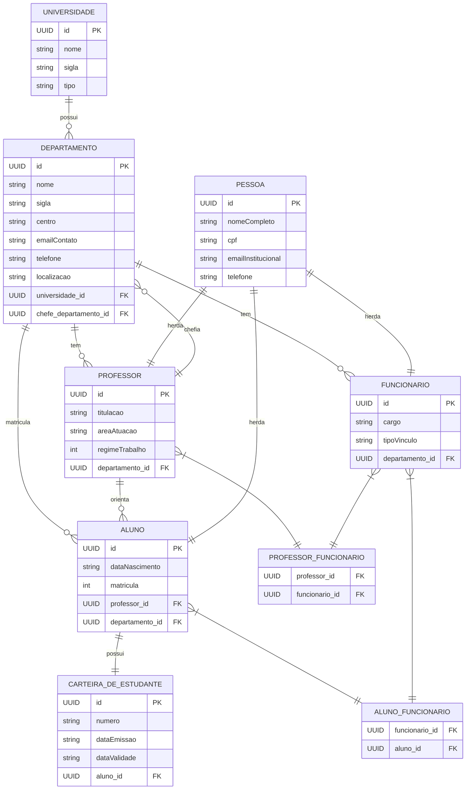

# Diagrama Entidade-Relacionamento (DER) - Sistema Escola

## Relacionamentos Detalhados

### 1:N (Um para Muitos)
- **Universidade → Departamentos**: Uma universidade possui vários departamentos
- **Departamento → Professores**: Um departamento tem vários professores
- **Departamento → Funcionários**: Um departamento tem vários funcionários
- **Departamento → Alunos**: Um departamento matricula vários alunos
- **Professor → Alunos**: Um professor orienta vários alunos

### 1:1 (Um para Um)
- **Aluno ↔ Carteira de Estudante**: Relacionamento bidirecional

### N:N (Muitos para Muitos)
- **Professores ↔ Funcionários**: Através da tabela `professor_funcionario`
- **Alunos ↔ Funcionários**: Através da tabela `aluno_funcionario`

### Herança
- **Pessoa**: Classe base para Professor, Funcionário e Aluno
- Estratégia: `JOINED` (tabelas separadas com chave estrangeira)